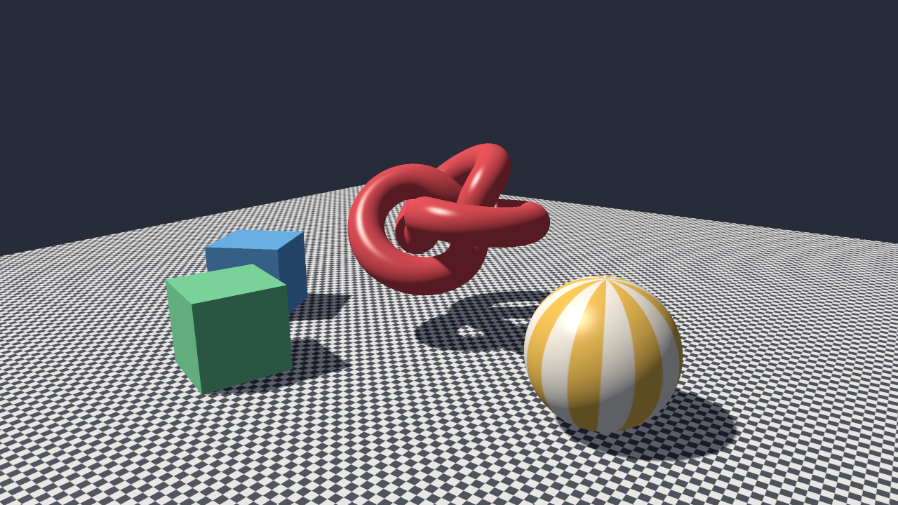
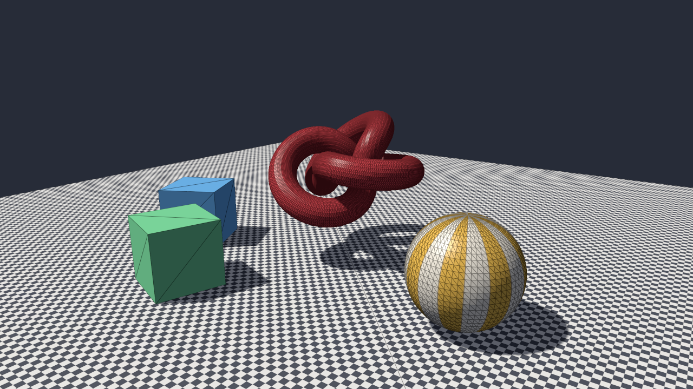

# swr

A 3D renderer that runs entirely on the CPU: it takes triangles from a scene or an OBJ model and produces the image a GPU would, with clipping, an exact rasterizer, depth buffering, perspective-correct mipmapped textures, Blinn-Phong lighting and shadow maps. For anyone who wants to see what a graphics API does underneath, in code that can be read in an afternoon.

**Status:** v0.1.0, working on Windows. The code is portable but was only run on Windows 11. Not published to crates.io; build from source.



## Features

- **Clipping** in homogeneous clip space against the near and far planes and a guard band, so triangles that pass behind the camera are cut correctly and huge ones cannot overflow the rasterizer.
- **Rasterization** with edge functions in fixed point (1/256 pixel) and the top-left fill rule: triangles that share an edge cover every pixel along it exactly once, with no gaps and no double hits.
- **Depth buffer**, back-face culling, and perspective-correct interpolation of every vertex attribute, with each attribute's screen-space derivatives available to the pixel shader.
- **Textures** with a mip chain built in linear light and nearest, bilinear or trilinear filtering, the level of detail taken from those derivatives; PNG and JPEG textures through my [lumen](https://github.com/r3clusionn/image-library) image library.
- **Lighting:** Blinn-Phong under a directional light and ambient light, shaded flat (the face normal from position derivatives), per vertex (Gouraud) or per pixel (Phong); sRGB-correct output.
- **Shadow maps** fitted to the scene from the light, filtered with 3x3 percentage-closer filtering and looked up with a normal offset, which removes shadow acne without detaching shadows.
- **Wireframe overlay** drawn by the pixel shader from barycentric coordinates (one pixel wide at any distance), and **supersampling** for anti-aliasing.
- **Parallel and deterministic:** the screen is split into 64x64 tiles drawn on all cores; triangles keep their order within a tile, so the image is bit-identical on any number of threads.
- **OBJ models** with polygons, negative indices, missing normals and MTL materials with diffuse textures; an interactive viewer; a benchmark.

## How to install

Requires a recent stable Rust (built and tested with 1.98.1).

```sh
git clone https://github.com/r3clusionn/software-renderer
cd software-renderer
cargo install --path .
```

This installs the `swr` binary.

## How to use

```sh
swr render demo.png --size 1920x1080 --ssaa 2          # the demo scene
swr render bunny.png --model bunny.obj                  # an OBJ model on a floor
swr render flat.png --shading flat --wireframe
swr view                                                # interactive
swr bench --size 1920x1080                              # time it at 1, 2, 4 ... all threads
```

| Option | What it does |
|---|---|
| `--size WxH` | Image or window size (default 1280x720). |
| `--model FILE` | An OBJ model instead of the demo scene, scaled to fit and set on the floor. |
| `--shading flat\|gouraud\|phong` | Lighting per face, per vertex or per pixel (default phong). |
| `--filter nearest\|bilinear\|trilinear` | Texture filtering (default trilinear). |
| `--shadow N` | Shadow map size; 0 turns shadows off (default 2048). |
| `--ssaa N` | Render N x N samples per pixel and average them (1 to 4). |
| `--wireframe` | Draw triangle edges over the shading. |
| `--threads N` | Threads to use (default: all). |

In `swr view`: drag with the left mouse button to orbit, the wheel to zoom, `1` `2` `3` for flat, Gouraud and Phong shading, `F` to cycle texture filtering, `S` shadows on or off, `W` wireframe, `A` 2x2 supersampling. The title bar shows the frame time.



## How it works

- **The pipeline** (`src/raster.rs`): vertices arrive in clip space with up to 20 attributes. A triangle entirely inside every plane passes untouched; otherwise Sutherland-Hodgman clipping cuts it against z = 0, z = w and x and y = ±16w, interpolating attributes linearly (they are linear in clip space). After the divide, positions are snapped to 1/256 pixel, so the edge functions are exact integer arithmetic and a vertex on a pixel centre or an edge along a row is decided by the fill rule, never by rounding.
- **Perspective.** Depth (z/w) is linear in screen space and is interpolated directly. Every other attribute a is interpolated as a/w and divided by the interpolated 1/w at each pixel; the derivative of that quotient, (d(a/w) * (1/w) - (a/w) * d(1/w)) / (1/w)^2, gives exact per-pixel derivatives for mipmapping and flat shading without the 2x2 pixel quads a GPU uses.
- **Tiles.** Each triangle is binned into the 64-pixel tiles its bounding box touches; threads take whole tiles from a shared counter, so no pixel is written by two threads and no locks are needed.
- **Shadows.** The scene is first drawn depth-only from the light with an orthographic projection fitted to every object's bounds. Each pixel looks up its world position, moved along its normal by half to two texels depending on how steeply the light hits it, and compares nine neighbouring shadow-map texels.

## Measurements

Intel Core i9-14900KF (8 performance and 16 efficiency cores), Windows 11, Rust 1.98.1, release build. `swr bench`: the demo scene (32,794 triangles, a 2048 x 2048 shadow map, per-pixel lighting, trilinear textures), 20 frames per setting after one warm-up frame, median.

| Threads | 1920x1080 | 1280x720 |
|---|---|---|
| 1 | 233 ms (4.3 fps) | |
| 4 | 75 ms (13.4 fps) | |
| 8 | 50 ms (19.9 fps) | |
| 16 | 41 ms (24.6 fps) | 30 ms (33 fps) |
| 24 | 33.5 ms (29.8 fps) | 25.4 ms (39.4 fps) |

Where a 1080p frame goes on 24 threads (timed per phase while tuning): about 17 ms rasterizing and shading the scene, about 10 ms clipping and setting up triangles for the shadow map and the scene, about 7 ms of vertex work, and the rest in allocating the buffers. The rasterizer alone runs about 11 times faster on 24 threads than on one (estimated from the phase timings); the whole frame 7 times, because the setup and vertex work are memory-bound (every vertex carries 20 attribute slots). Turning shadows off saves about 13 ms.

Two things found while measuring: each object was first drawn as its own parallel pass, so a small object (a cube covering a few tiles) left most threads idle until it finished, and the frame cleared its colour buffer twice. Drawing all objects in one pass (`draw_batches`) and filling the buffer once took the 1080p frame from 49.6 to 33.5 ms. Moving every parallel section onto one persistent pool (my [workpool](https://github.com/r3clusionn/thread-pool-library)) instead of starting threads per section measured no difference, but keeps a frame from creating threads.

## Verification

- `cargo test --release`: 19 tests. Clippy reports nothing.
- **Against a ray caster.** 62 random triangles (two of them crossing the near plane and passing behind the camera) are rasterized at 160x120 with a triangle-ID buffer, and a ray is cast through every pixel centre with the Möller-Trumbore test. Every pixel agrees except where the answer is genuinely ambiguous: the centre lies within 0.1% of an edge or two triangles are within 0.1% of the same depth (the test requires over 90% of pixels to be compared; there are no mismatches).
- **Fill rule.** Jittered grids of triangles (6, 13 and 40 cells across, extending past the screen, one grid with every vertex snapped onto pixel centres and edges along pixel rows) are drawn with additive blending: every pixel of the 97x61 target is covered exactly once. A right triangle of legs 10 pixels covers exactly 50.
- **Perspective.** A floor 42 units deep seen at a grazing angle: interpolated texture coordinates agree with the ray-plane intersection at every covered pixel to within 0.02 units; the same floor drawn with screen-space (affine) interpolation is off by more than 1 unit, so the test can tell the difference.
- **Determinism.** 3,000 overlapping random triangles give bit-identical colour and depth buffers on 1 and on 7 threads.
- **Scenes.** A lit floor alone has exactly the same colour at every pixel (no shadow acne); a slab casts a shadow (turning shadows off brightens over 100 pixels); every shading mode with and without wireframe and supersampling renders only finite colours; an OBJ tetrahedron loads and appears in the centre of the view.
- **Parts.** Matrix inverse, the projection's depth range, a right-handed rotation, look-at; sRGB conversion round-trips all 256 values; the mip chain averages correctly and the level of detail follows the texel footprint; bilinear filtering is exact at texel centres and wraps; generated meshes face outwards; OBJ polygons, negative indices, materials and errors (an out-of-range index names the line).
- **The viewer** was run in a real 1280x720 window (found and captured through the Win32 API): it rendered the scene continuously, using about 7.7 cores' worth of CPU time and 64 MB of memory.
- **By eye.** The first render showed shadow acne (stripes on the cube faces, rings on the sphere), which the normal-offset lookup removed; the screenshots here are from the current code.

## Limits

- One directional light; no point or spot lights, no transparency or blending of colours, no normal maps, no reflections.
- No MSAA: anti-aliasing is supersampling, which shades every sample.
- Texture filtering is isotropic (trilinear); floors at grazing angles blur where anisotropic filtering would stay sharp.
- OBJ support covers geometry, normals, texture coordinates and diffuse materials; other MTL properties and other file formats are not read.
- Tested on Windows 11 only.

## License

MIT (see `LICENSE`).
